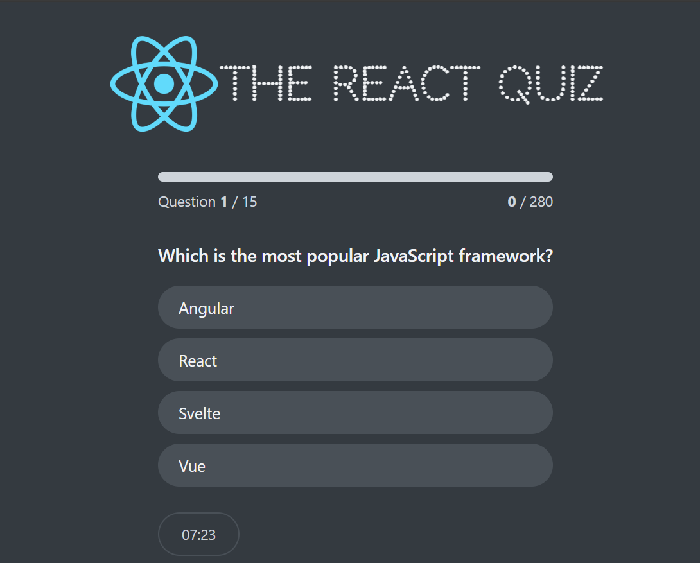

# React Quiz Application

This is a React-based quiz application designed to test users' knowledge of React concepts. The application includes various features like timed questions, score tracking, and high score display.

## Features

- **Multiple Components:** The application is divided into several components for better organization and reusability, such as `Header`, `Main`, `Loader`, `Error`, `StartScreen`, `Question`, `NextQuestion`, `Progress`, `FinishScreen`, `Timer`, and `Footer`.
- **State Management:** Utilizes the `useReducer` hook for managing the application's state, handling different statuses including loading, error, ready, active, and finished.
- **Timer:** Each question has a time limit of 30 seconds, displayed through a timer component.
- **Score Tracking:** Points are awarded for correct answers, and the total score is displayed at the end of the quiz.
- **High Score:** The highest score achieved is saved and displayed.
- **Local Server:** Questions are fetched from a local server using `json-server`.

## Installation

1. **Clone the repository:**

   ```bash
   git clone https://github.com/your-username/react-quiz-app.git
   cd react-quiz-app
   ```

2. **Install dependencies:**

   ```bash
   npm install
   ```

3. **Start the local server:**

   ```bash
   npm run server
   ```

4. **Start the application:**
   ```bash
   npm start
   ```

## Usage

1. Open the application in your browser at `http://localhost:3000`.
2. Click "Let's start" to begin the quiz.
3. Answer the questions within the given time.
4. Navigate through the questions using the "Next" button.
5. View your score and high score at the end of the quiz.

## Project Structure

- `src`
  - `components`
    - `Header.js`
    - `Main.js`
    - `Loader.js`
    - `Error.js`
    - `StartScreen.js`
    - `Question.js`
    - `NextQuestion.js`
    - `Progress.js`
    - `FinishScreen.js`
    - `Timer.js`
    - `Footer.js`
  - `App.js`
  - `index.js`
- `data`
  - `questions.json`
- `package.json`

## Dependencies

- React
- json-server
- @testing-library/react
- @testing-library/jest-dom
- @testing-library/user-event
- web-vitals

## Scripts

- `start`: Starts the React development server.
- `build`: Builds the app for production.
- `test`: Runs the test suite.
- `eject`: Ejects the app from `react-scripts`.
- `server`: Starts the local server using `json-server` to serve questions.

## screenshoot



## Contributing

Contributions are welcome! Please fork the repository and submit a pull request for any changes.

## live demo
https://react-quiez-app.netlify.app
